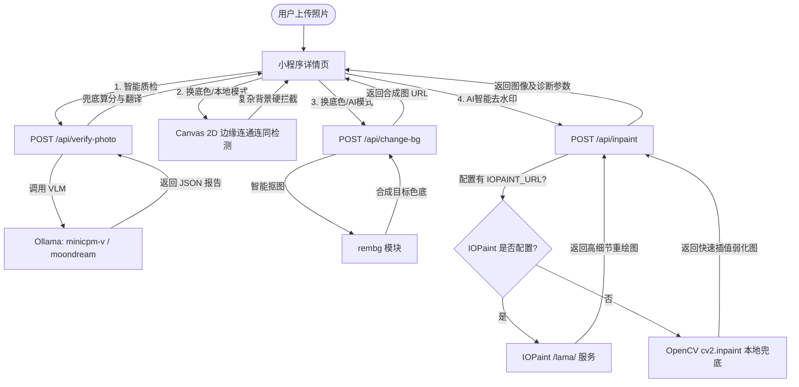

# 📷 证件照生成器 — 开源技术栈与大模型服务说明

为了保证本小程序的商业化演进与极致体验，我们对 AI 能力进行了清晰的架构拆分与能力边界划分。请勿混淆 Ollama 本地视觉模型、抠图/换底色模型、以及去水印/修复模型的职责。

---

## 🛠️ 开源核心技术栈

### 1. Ollama (本地视觉模型)
*   **官方网站**: [https://ollama.com/](https://ollama.com/)
*   **用途边界**: **仅用于图像理解、人脸质检、文本与 JSON 报告输出**。
    *   *能做*: 智能分析照片清晰度、检测人脸五官是否遮挡、判断背景是否杂乱、评估光照均匀度与姿态倾斜度、最终输出标准的 JSON 格式评分与建议报告。
    *   *不能做*: 任何像素级图片修改（如：抠图、换底色、擦除水印、换装、像素修复等）。
*   **默认端口**: `11434`
*   **推荐模型**: 
    *   `minicpm-v:latest` (5.5B 高清多模态视觉模型，人脸检测极其精准透彻，**推荐**)
    *   `moondream:latest` (1.8B 极速多模态视觉模型，运行极省资源，快速反馈)
*   **服务调用方式**: FastAPI 后端通过调用本地 `http://127.0.0.1:11434/api/generate` 接口流式或单次获取结构化质检评估 JSON。

---

### 2. rembg (背景移除模型)
*   **开源链接**: [https://github.com/danielgatis/rembg](https://github.com/danielgatis/rembg)
*   **用途边界**: **人像/主体高精度抠图，生成透明背景 PNG 图**。
    *   *能做*: 像素级自动识别人像主体，完美扣除背景，精细保留发丝、衣服边缘，生成干净的透明通道 PNG，并用作红/蓝/白底色合成的底料。
    *   *不能做*: 质检评估、选区去水印等。
*   **依赖库**: 
    ```bash
    pip install rembg
    ```
    *(底层自动下载并使用 u2net 预训练人像分割模型)*
*   **服务调用方式**: Python 后端直接导入并执行 `rembg.remove()` 函数，无感快速本地计算。

---

### 3. IOPaint (AI 图像修复 / 去水印模型)
*   **开源链接**: [https://github.com/Sanster/IOPaint](https://github.com/Sanster/IOPaint)
*   **官方网站**: [https://www.iopaint.com/](https://www.iopaint.com/)
*   **用途边界**: **利用 Mask 选区和 AI 重绘核心技术，实现无痕去水印、擦除杂物与背景脑补**。
    *   *能做*: 高精度的像素级擦除、去除各种复杂的全屏水印、人像瑕疵修复、智能生成并脑补空缺处的背景纹理。
    *   *不能做*: 图像质检、直接换底色。
*   **默认端口**: `8080` (后端可在环境变量中配置 `IOPAINT_URL`)
*   **核心模型**: `LaMa` (Resolution-robust Large Mask Inpainting)
*   **服务调用方式**:
    *   启动 IOPaint 后台服务:
        ```bash
        iopaint start --model=lama --device=cpu --port=8080
        ```
    *   FastAPI 后端通过接收前端框选坐标，自动为原图绘制选区 Mask，并转发多部分请求到 `http://127.0.0.1:8080/inpaint` 完成高精 AI 擦除。

---

### 4. OpenCV (本地 CV 兜底)
*   **开源链接**: [https://github.com/opencv/opencv](https://github.com/opencv/opencv)
*   **用途边界**: **作为 AI 去水印未启动时的超轻量级本地兜底，通过基于传统数学邻域插值的快速修复来擦除水印选区**。
    *   *能做*: 基于 Rect 选区快速生成二值化 Mask，使用 `cv2.inpaint()` 的 `INPAINT_TELEA` 或 `INPAINT_NS` 算法在几毫秒内抹除水印并模糊处理。
    *   *不能做*: 复杂水印无痕擦除、脑补高细节大块背景。
*   **依赖库**:
    ```bash
    pip install opencv-python-headless
    ```
*   **服务调用方式**: Python 后端在 `IOPAINT_URL` 为空或不可用时，自动路由到 `services/inpaint.py` 执行 OpenCV 的连通域快速修复，返回带有诊断模式的图像。

---

### 5. we-cropper (前端裁剪库)
*   **开源链接**: [https://github.com/we-plugin/we-cropper](https://github.com/we-plugin/we-cropper)
*   **用途边界**: **小程序端照片高精度缩放、平移及生成规范裁剪坐标**。
    *   *能做*: 为用户在小程序前端提供一个精美的圆形或矩形裁切框，支持手势双指缩放、拖拽移动，并最终输出裁切后图片的临时路径或标准比例坐标。
    *   *不能做*: AI 像素修复、自动人脸识别。
*   **服务调用方式**: 小程序通过引入本地 `we-cropper.js` 组件，将其绑定在 canvas 上作为标准交互式裁剪组件。

---

## ⚡ 架构流程图 (AI 服务流向)


